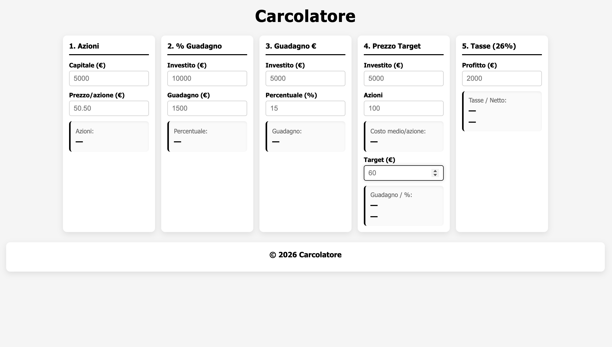

# 📊 Carcolatore

Uno strumento web semplice e intuitivo per eseguire calcoli finanziari rapidi sugli investimenti in azioni.

## 📸 Screenshots

Interfaccia pulita e moderna con tutte le sezioni di calcolo visibili in una sola riga:



## 📋 Descrizione

**Carcolatore** è uno strumento finanziario pensato per chi investe in azioni e ha bisogno di fare calcoli veloci e precisi. L'interfaccia è minimalista, il design è bianco e nero e tutti i calcoli avvengono automaticamente mentre digiti i dati.

## ✨ Caratteristiche

✅ **Calcolo Azioni Acquistabili** - Scopri quante azioni intere puoi comprare con il tuo capitale

✅ **Percentuale di Guadagno Desiderato** - Calcola la percentuale necessaria per raggiungere un obiettivo di guadagno

✅ **Guadagno da Percentuale** - Scopri quanto guadagnerai con una percentuale di crescita

✅ **Guadagno su Prezzo Target** - Calcola guadagno totale e percentuale con costo medio per azione automatico

✅ **Calcolo Tasse** - Applica automaticamente il 26% di tasse sui profitti e mostra il netto

✅ **Calcoli Automatici** - Nessun pulsante, i risultati si aggiornano mentre digiti

✅ **Zero Dipendenze Esterne** - Funziona completamente lato client, no API, no database

## 📐 Calcolatori Disponibili

### 1️⃣ Azioni Acquistabili
- Input: Capitale disponibile, Prezzo per azione
- Output: Numero di azioni intere acquistabili
- Formula: `⌊Capitale / Prezzo per azione⌋`

### 2️⃣ Percentuale di Guadagno Desiderato
- Input: Somma investita, Guadagno desiderato (€)
- Output: Percentuale di guadagno necessaria
- Formula: `(Guadagno / Investimento) × 100`

### 3️⃣ Guadagno da Percentuale
- Input: Somma investita, Percentuale di guadagno (%)
- Output: Guadagno in euro
- Formula: `(Investimento × Percentuale) / 100`

### 4️⃣ Guadagno su Prezzo Target
- Input: Investimento, Numero azioni, Prezzo target per azione
- Calcola automaticamente: Costo medio per azione
- Output: Guadagno totale (€) e Percentuale di guadagno (%)
- Formula: `Guadagno = (Prezzo target × Azioni) - Investimento`

### 5️⃣ Calcolo Tasse (26%)
- Input: Profitto lordo
- Output: Importo tasse (26%) e Profitto netto
- Formula: `Tasse = Profitto × 0.26` | `Netto = Profitto - Tasse`

## 🎮 Come Usare

1. **Apri il sito**
   - Apri il file `index.html` in un browser

2. **Inserisci i dati**
   - Compila i campi della sezione che ti interessa
   - I calcoli si aggiorneranno automaticamente

3. **Leggi i risultati**
   - I risultati appaiono istantaneamente nella sezione risultati
   - Modifica i dati quando vuoi per vedere come cambiano i risultati

## 📁 Struttura del Progetto

```
Carcolatore/
├── index.html          # File HTML principale con tutte le sezioni
├── style.css           # Foglio di stile (design bianco/nero)
├── script.js           # Logica JavaScript dei calcoli
└── README.md           # Questo file
```

### File Descriptions

**index.html**
- Contiene la struttura HTML di tutte le 5 sezioni di calcolo
- Header con titolo del progetto
- Main con le 5 sezioni in layout orizzontale
- Footer con crediti

**style.css**
- Design moderno minimalista (bianco, nero, grigio)
- Layout Flexbox per disposizione orizzontale
- Ombre per profondità
- Responsive design con media queries
- Animazioni smooth su hover

**script.js**
- 5 funzioni di calcolo (una per ogni sezione)
- Event listeners per input automatici
- Validazione dei dati
- Formatting dei risultati

## 🔧 Requisiti

- ✅ Un browser moderno (Chrome, Firefox, Safari, Edge)
- ✅ Nessun server richiesto
- ✅ Nessuna installazione necessaria

## 🚀 Come Avviare

### Metodo 1: Diretto dal File System
1. Naviga alla cartella del progetto
2. Doppio click su `index.html`
3. Il sito si apre nel browser predefinito

### Metodo 2: Tramite Browser
1. Apri il tuo browser
2. Premi `Ctrl+O` (Windows) o `Cmd+O` (Mac)
3. Seleziona il file `index.html`

### Metodo 3: Con Server Locale (consigliato)
Se vuoi un'esperienza più fluida, usa un server locale:

```bash
# Se hai Python 3
python -m http.server 8000

# Se hai Python 2
python -m SimpleHTTPServer 8000

# Poi apri http://localhost:8000
```

Oppure con Node.js:
```bash
npx http-server
```

## 💡 Esempi di Utilizzo

### Esempio 1: Quante azioni posso comprare?
- Capitale: €5.000
- Prezzo per azione: €50
- **Risultato**: 100 azioni

### Esempio 2: Quale percentuale mi serve?
- Investimento: €10.000
- Guadagno desiderato: €1.500
- **Risultato**: 15%

### Esempio 3: Quanto guadagno con il 20%?
- Investimento: €5.000
- Percentuale: 20%
- **Risultato**: €1.000 di guadagno

### Esempio 4: Guadagno al prezzo target?
- Investimento: €5.000
- Azioni: 100
- Target: €60
- **Risultato**: €1.000 di guadagno (+20%)

### Esempio 5: Quanto mi rimane dopo le tasse?
- Profitto lordo: €2.000
- **Risultato**: Tasse €520, Netto €1.480

## ⚙️ Funzionamento Tecnico

### Architettura
- **Frontend Only**: Tutto il codice gira nel browser dell'utente
- **No Backend**: Nessun server, nessun database
- **No API**: Nessuna connessione esterna
- **Privacy**: I tuoi dati rimangono nel tuo dispositivo

### Calcoli in Tempo Reale
- Gli event listeners sono registrati su tutti gli input
- Quando cambi un valore, il calcolo si esegue automaticamente
- I risultati si aggiornano in millisecondi

### Validazione Input
- Controllo che i numeri siano validi
- Controllo che i valori positivi siano effettivamente positivi
- Gestione dei casi di input invalido

## 📝 Note Importanti

⚠️ **Disclaimer**: Questo strumento fornisce stime a scopo informativo e non costituisce consulenza finanziaria. Usa i risultati come riferimento, non come base per decisioni di investimento critiche.

💰 **Tasse**: Il calcolo delle tasse al 26% rispecchia le aliquote sulle plusvalenze in Italia. Consulta un commercialista per situazioni specifiche.

🔢 **Precisione**: I calcoli usano numeri in virgola mobile con 2 decimali di precisione.

## 🎨 Customizzazione

### Cambiare i Colori
Modifica il file `style.css`:
```css
header h1 {
    color: #000;  /* Cambia il colore del titolo */
}

.calculator-section h3 {
    color: #000;  /* Cambia il colore dei sottotitoli */
    border-bottom: 2px solid #000;  /* Cambia il colore del bordo */
}

.result-value {
    color: #000;  /* Cambia il colore dei risultati */
}
```

### Aggiungere Nuovi Calcoli
1. Aggiungi una nuova `<section>` in `index.html`
2. Scrivi la funzione di calcolo in `script.js`
3. Registra gli event listeners nel `DOMContentLoaded`

## 🐛 Troubleshooting

**I calcoli non si aggiornano**
- Assicurati che gli ID degli input nel HTML corrispondano a quelli nel JavaScript
- Controlla la console del browser (F12) per errori

**Il sito sembra strano**
- Svuota la cache del browser (Ctrl+Shift+Del)
- Prova un browser diverso

**Gli input non accettano numeri**
- Verifica che il browser supporti `type="number"`
- I browser più vecchi potrebbero richiedere aggiornamenti

## 📜 Licenza

Questo progetto è gratuito e open source. Usalo, modificalo e condividilo liberamente.

## 👨‍💻 Autore

Creato con ❤️ per aiutare gli investitori a fare calcoli finanziari rapidi e precisi.

---

**Versione**: 1.0  
